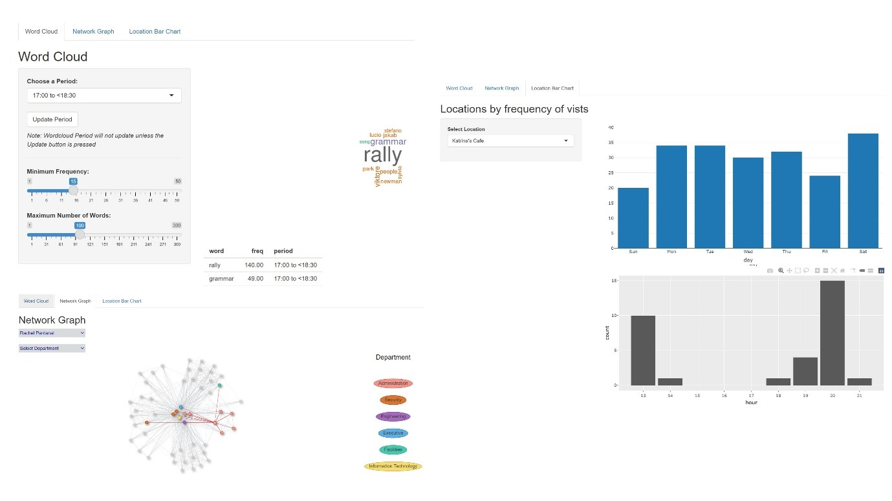
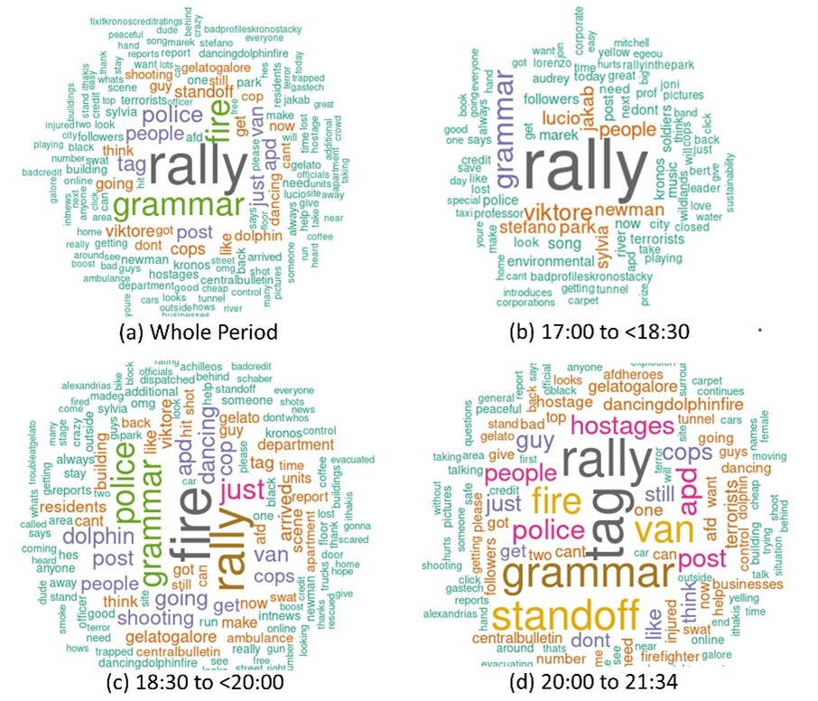
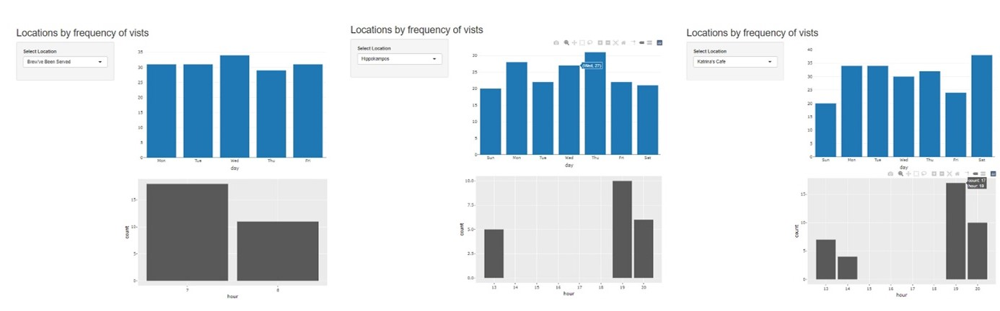

```{r, include=FALSE}
knitr::opts_chunk$set(echo = FALSE,
                      warning = FALSE,
                      tidy = FALSE,
                      message = FALSE,
                      fig.align = 'center',
                      out.width = "100%")
options(knitr.table.format = "html") 
```

# Introduction

The **VAST Challenge 2021** describes a hypothetical scenario where some of the employees of a fictitious organization, *GAStech* have gone *missing on 23 Jan 2014 (Thursday)*. It is suspected that *Protectors of Kronos (POK)*, an environmental activist group might be related to this incident. Dataset given in this case contains a collection of microblog records and text transcripts of emergency calls by local public service departments from the days surrounding the disappearance.

This challenge requires identification of suspicious activities and behaviour hidden in data. In addition, it is also required to evaluate the changing levels of risk to the public. Our team has developed a *web-based visual analytics system* to analyse microblog and call centre messages exchanged on the event evening. It also provides interactive methods to analyse the popular locations and the connection among the employees of GAStech


```{r, include=FALSE}
knitr::write_bib(c('posterdown', 'rmarkdown','pagedown'), 'packages.bib')
```

## Objectives

1. Study the datasets using the tools and techniques of Visual Analytics.
2. Identify concrete clues from the visuals that can assist in solving the crime.
3. Harness the power of R in designing interactive graphs.

## Dataset

This study uses selected datasets given by VAST 2021 Mini-Challenge 1, 2 & 3. The datasets provide information containing 4,063 records of microblog and call centre data, credit and debit card transaction location and timestamp (cc_data.csv) and car assignment data which contains 44 vehicle ids with assigned employee names and employment type and title (car_assignemnts.csv).  In addition, email headers dataset was used which contains the subjects of the emails exchanged between the employees of the company.

# Methodology

To reveal the change of risk level and the riskiest location where the event took place, we need to investigate important information using files from different sources. The interactive web-based application was developed using R and Shiny packages for interfacing with a backend server for the visualization frontend. It serves as a quick overview tool of the original data which allows us to focus only on related period and locations. Given the nature of our main dataset, frequency analysis would be appropriate for our study. 

As the data volume is large, we will therefore focus on the transcripts from the call centre, employment relations as well as timestamp and location of the card transactions and the email headers in the following three aspects:
a)	Word Cloud
b)	Network Graph
c)	Location Bar Chart 

{width=90%}

# Findings and Discussions

## Word Cloud

The word cloud tab displays the word cloud from call center messages and microblog messages, filtered by the selected period and frequency of appearance. 

To find out top words used in the messages exchanged four options were used to allow users to narrow down the period. In addition, users can specify the minimum frequency of words and maximum number of words appeared which allow users to find out if risk is happening and what kind of risk is happening.



**Major Observations**

+ Most frequently mentioned word is “rally”.
+ The riskiest period was from 18:30 to 20:00 with the highest frequency words being “Fire”. 
+ Increasing trend of mentioning “Police” and “Cop” after 20:00 which indicate the risky event already took place.
+ The word “Standoff” which shows that a response to the risk has occurred. 

*This implies that the riskiest period is 18:30 to 20:00 followed by 20:00 to 21:34 and then 17:00 to 18:30 on the event evening on 23 Jan 2014*

## Network Graph

The network graph provides the relations of email communications between GAStech employees. By selecting the name of the employee from the dropdown list, his/her email communications with other employees are shown. By selecting the department, all the employees of the department get highlighted. We can zoom in to know the names of the employees. This graphs helps us to get the name of the employees with whom maximum email communications was done. 

{width=100%}

## Location Bar Chart

The location bar chart tab displays the location by frequency of visits and the day and time of the visits when zoom in. It accumulates the total number of transactions made by visitors between 6 Jan 2014 to 19 Jan 2014. 

{width=80%}

**Major Observations**

+ The frequency of the number of visits is more on weekdays as compared to weekends.
+ Brew've Been Served is the most popular shop among GAStech employees especially during weekday 7-8 am where the employees go for morning coffee. 
+ Katrina’s Café and Hippokampos are the top two most visited shops for lunch and dinner.

# Conclusion and Future Work

While we tried to exploit the datasets, but none of these visualizations on its own was sufficient to answer the questions in VAST Challenge. Instead, we used information from combinations of the Shiny apps to gain a better understanding of the data. 

There were some improvements that we could work on in the future including:

Linking up Word Cloud and Location Popularity data, for example, Location Popularity on a certain date when the risk occurred to find out exactly how many people were in the risks areas and of course, how many people were affected by the incident at the various periods of time.

Another improvement would be to possibly add a frequency element to the network graph in order to find which users are the closest together. If we can map these users to a time element, we can possibly find out which people are involved in the incident and provide a more focused response


# References

+ M. Whiting et al., "VAST challenge 2014: The Kronos incident," 2014 IEEE Conference on Visual Analytics Science and Technology (VAST), 2014, pp. 295-300, doi: 10.1109/VAST.2014.7042536.

+ [Interactive Network Visualization with R](https://www.statworx.com/ch/blog/interactive-network-visualization-with-r/)


library(pagedown)
pagedown::chrome_print("ShinyVA.html")

