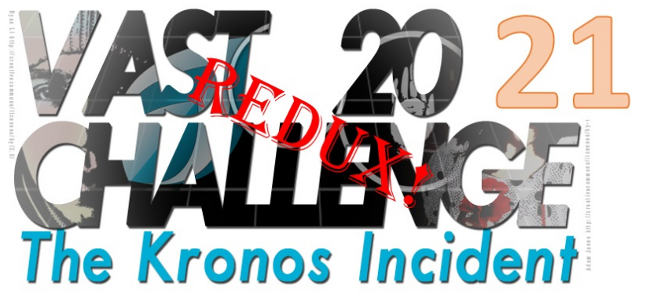
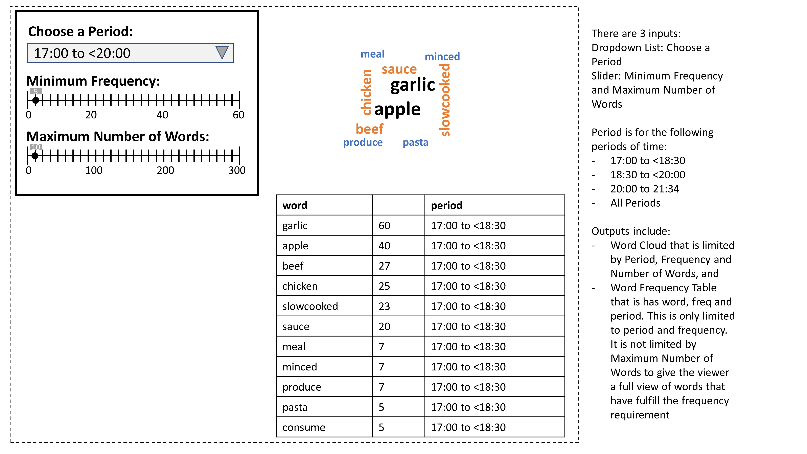
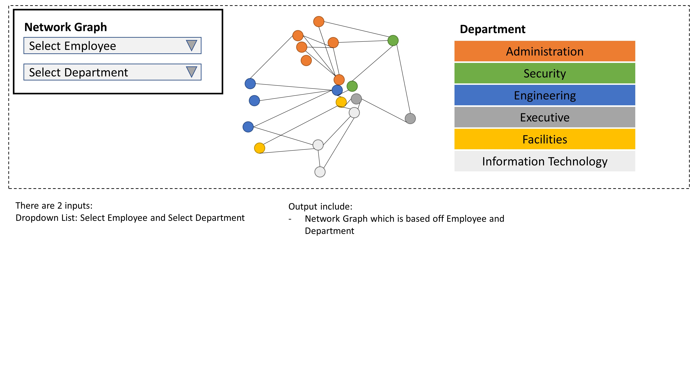
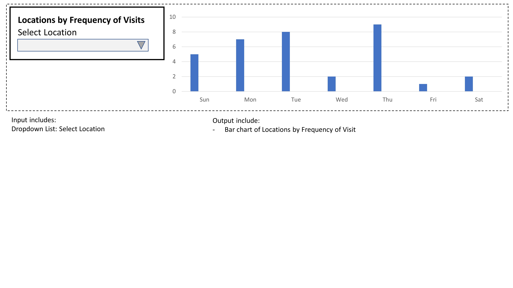

```{r setup, include=FALSE}
knitr::opts_chunk$set(echo = FALSE)
```



In the roughly twenty years that Tethys-based GAStech has been operating a natural gas production site in the island country of Kronos, it has produced remarkable profits and developed strong relationships with the government of Kronos. However, GAStech has not been as successful in demonstrating environmental stewardship.

In January, 2014, the leaders of GAStech are celebrating their new-found fortune as a result of the initial public offering of their very successful company. In the midst of this celebration, several employees of GAStech go missing. An organization known as the Protectors of Kronos (POK) is suspected in the disappearance, but things may not be what they seem.

Our aim is to decode this mystery.

For this our storyboard is as follows:








